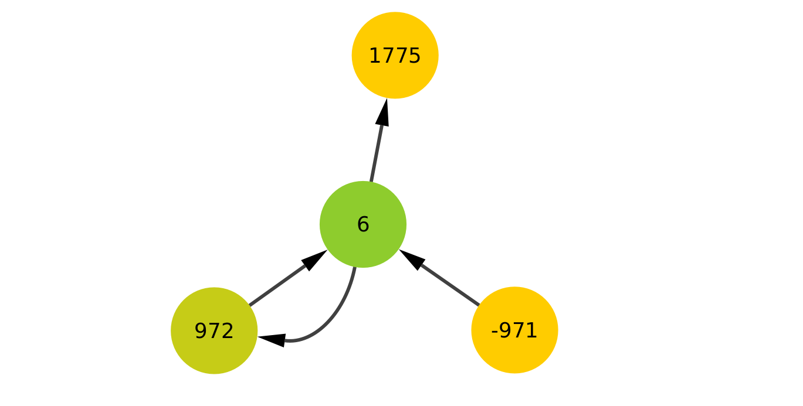
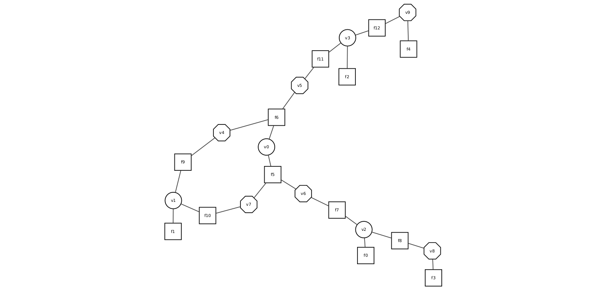

# Visualisation of the graphs used in Detox

It is possible to visualise (subgraphs of) the de Bruijn graph and corresponding factor graphs as they are used in Detox, with [Cytoscape](https://cytoscape.org/).
To obtain the necessary files rerun detox with 

      detox -vis-subgraph x -crf-nb-size y [-approx-inf] [other inference options] reads.unitigs.fa reads.mf

Detox will then rerun inference for all nodes in a subgraph of size `y` around node `x` and output `cytgraphxnby.arcs` and `cytgraphxnby.nodes`. If you add the `approx-inf` option, approximate inference will be run for the CRF corresponding with the subgraph and the following additional files representing the factor graph of the CRF will be produced: `factorgraph.x.nby.cyt.arcs`, `factorgraph.x.nby.cyt.nodes` and `factorgraph.x.nby.fg`. Without the `-approx-inf` option, each multiplicity will be computed with exact inference on a CRF of a subgraph of size `y` around each node and arc in the visualisation. 

When `reads.unitigs.fa.st3`, `model.node.st3` and `model.edge.st3` are present, the subgraph will be taken from the cleaned de Bruijn graph after stage 3, and the corresponding retrained model will be used for inference. When these are not present, Detox searches for `reads.unitigs.fa.st1`, `model.node.st2` and `model.edge.st2` and the subgraph is taken from the uncleaned de Bruijn graph with its corresponding coverage model. When the files `*.st1` or `*.st2` are not present, stage 1 and/or stage 2 are run before subgraph extraction. To obtain true multiplicities in the output detox looks for the files `truemult.node` and `truemult.edge` when using the stage 3 graph or for `truemult.node.st1` and `truemult.edge.st1` when using the stage 1 graph.

## Styles in Cytoscape

While you can use one of the default styles provided by Cytoscape and set visualisation parameters thereof yourself, we included the styles we used and find most useful in `detox_styles.xml`. These can be imported into Cytoscape with *File > Import > Styles from File...* selecting the provided xml file. 

## de Bruijn graph visualisation
To visualise the de Bruijn graph of a subgraph of size `y` around node `x`, import `cytgraphxnby.arcs` into Cytoscape with *File > Import > Network from File* and afterwards import `cytgraphxnby.nodes` with *File > Import > Table from File*. When you use our dBG style (go to Styles and select dBG from the dropdown menu after you have imported the xml file), your graph will look like this: 

This example is a subgraph of size 1 around node 6, the corresponding `.arcs` and `.nodes` files can be found in this folder as well. Nodes are coloured according to their estimated multiplicity, the border will be coloured according to the true multiplicities if this information is provided. Here all assignments were correct, and the borders are thus not visible.

These Cytoscape files contain several other columns that can be checked (or used for additional visualisation style) inside Cytoscape:

The `cytgraphxnby.arcs` file contains:
  - Source node and Target node: needed to create the network in Cytoscape, these represent the nodeIDs from detox.
  - Coverage: the k+1-mer coverage of the arc
  - True mult.: the true multpilicity if the necessary files could be found; contains -1 otherwise
  - Est mult.: the estimated multiplicity according to the CRF-model
  - LOR: the log odds ratio of the probability of the estimated multiplicity vs. the probability that the multiplicity is not the estimated multiplicity
  - Belief: probability of/belief in the estimated multiplicity
  - correct: 1 if True mult. and Est mult. are equal, 0 otherwise

The  `cytgraphxnby.nodes` file contains:
  - Node ID: node id of the de Bruijn graph node
  - Marginal length: number of k-mers contained in the node (each node represents a unitig and is often a contraction of multiple k-mers
  - Left arcs: number of left (incoming) arcs
  - Right arcs: number of right (outgoing) arcs
  - Coverage: average k-mer coverage of the node
  - True mult.: the true multpilicity if the necessary files could be found; contains -1 otherwise
  - Est mult.: the estimated multiplicity according to the CRF-model
  - LOR: the log odds ratio of the probability of the estimated multiplicity vs. the probability that the multiplicity is not the estimated multiplicity
  - Belief: probability of/belief in the estimated multiplicity
  - correct: 1 if True mult. and Est mult. are equal, 0 otherwise
  - Sequence: the nucleotide sequence contained in the node

## Factor Graph visualisation

To visualise the factor graph of the CRF modeling the de Bruijn graph of size `y` around node `x`, import `factorgraph.x.nby.cyt.arcs` into Cytoscape with *File > Import > Network from File* and afterwards import `factorgraph.x.nby.cyt.nodes` with *File > Import > Table from File*. 
When you use our factorGraph style (go to Styles and select factorGraph from the dropdown menu after you have imported the xml file), your graph will look like this: 

This factorgraph corresponds to the CRF of the de Bruijn graph in the example above.

The necessary files contain the following information:

`factorgraph.x.nby.cyt.arcs`:
  - source: the labels of the factor nodes
  - target: the labels of the corresponding variable nodes

`factorgraph.x.nby.cyt.nodes`:
  - ID: the variable node `vi` or factor node `fi` ID
  - node type: denotes the type of node (0: variable node corresponding to de Bruijn graph node, 1: variable node corresponding to de Bruijn graph arc, 2: factor node)
  - dBG ID: node ID in the de Bruijn graph, only in case of variable nodes corresponding to de Bruijn graph nodes.

## Correspondence between the different files

When constructing a factor graph for approximate inference computations, the variable nodes are simply numbered from 0 to numVar. To be able to see correspondence between the factor graph and the de Bruijn graph, we include the de Bruijn graph node ID's with the variable nodes that correspond with a de Bruijn graph node.
In the example given here, v0 corresponds to node 6, v1 to node 972, v2 to node -971 and v3 to node 1775.
You will see that variable nodes are added in the factor graph for the outgoing arc of node 1775 and the incoming arc of node -971, even though these are not visible in the de Bruijn graph visualisation. The fields Left arcs and Right arcs will, however, show the existence of such arcs in the full de Bruijn graph and they are used in the conservation of flow factors created for nodes 1775 and -971, which is why they are included in the factor graph.

While the Cytoscape factorgraph only visualises the structure of the factorgraph, the file `factorGraph.x.nby.fg` is libDAI's native factor graph output format and contains the actual factors, including all values of considered multiplicity assignments or combinations thereof. Each factor is represented in libDAI's factor block format. More information about this format can be found in the [libDAI documentation](https://staff.fnwi.uva.nl/j.m.mooij/libDAI/doc/fileformats.html). The numbers on the second line of each factor block refer to variables i_1, ..., i_m, these correspond with variable nodes vi_1, ..., vi_m in the cytoscape visualisation. Note that the values assigned to factor graph variables always range from 0 to maximally (2 x `-crf-margin` + 1). The central values needed to determine the multiplicities from these assignments are only kept internally.
